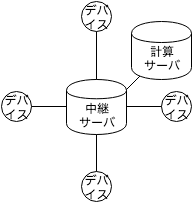

何書いていいのかわからないから徒然なるままに書き出してみよう。

えーとまず、このシステムはなにか、について。

このリポジトリにあるコードはノートパソコンやスマートフォンなどのマイクとスピーカを備え、
ウェブブラウザが動き、ネットワークにつながるスマートデバイスをアレイ化し同期的に制御するためのものである。
アレイ化し同期的に制御、とはどういうことかというと、一例を挙げるならば、
スマートデバイスの持っているスピーカを同期的に制御することで、
複数のスマートデバイスをまとめてスピーカアレイシステムとして動かすことができ、
また、マイクロホンアレイを構築して、音源分離なども可能である。

というわけで、このライブラリはスマートデバイス間での時刻的同期を実現する。
具体的は、各スマートデバイスのブラウザ間の、AudioContextのcurrentTimeの相対的な時刻ズレを計測する。
以下にその概要を説明する。

## 先行研究、類似研究
* WASN

## 時刻同期

- 質問信号と応答信号の時間差で同期できる
  - <small>Timing-sync Protocol for Sensor Networks[Saurabh Ganeriwal]</small>
  - <small>BeepBeep: A High Accuracy Acoustic Ranging System using COTS Mobile Devices[Chunyi Peng]</small>
- $t_0'$ の時刻を推定

* TPSN(time-sync protecd for sensor network)
基準となる時刻が違う二つの時間軸を持つ端末間において同期するには、
互いに音声パルスを出せばよい。

端末 $A$ が自身の時刻 $t_0$ に音声パルスを発生すると、
そのパルスは音速で空間に広がり、
端末 $B$ 内の時刻 $t_1$ に受信される。
さらに、端末 $B$ からも端末 $B$ 内の時刻 $t_2$ に音声パルスを発すると、
このパルスも音速で空間に広がり、
端末 $A$ 内の時刻 $t_3$ に受信される。
ここで、図の通り、
端末 $A$ 内のパルス時間間隔 $t_3-t_0$ と
端末 $B$ 内のパルス時間間隔 $t_2-t_1$ には差が生じる。

パルスの往復で伝播にかかった時間は共に等しいと仮定すると、

$$
t_0' = t_1 - \frac{(t_3 - t_0) - (t_2 - t_1)}{2} \\
$$

となり、端末 $B$ 内時刻で端末 $A$ のパルスが発せられた時刻を推定することができる。
端末間の相対速度はゼロとすれば、特殊相対性理論の時間の遅れを気にする必要はない。
また、端末間での置かれている重力場の差も無視すれば、一般相対性理論の時間の遅れも気にする必要はない。
我々は日常のスケールを扱っているので何も問題はない。

以上が時刻同期の原理である。
ここで、音速を $c$ とすれば、副次的に端末間の距離も求まる。

これは2次レーダーによる距離測定装置の、イントロゲータとトランスポンダとおおよそ同じ仕組みである。

レーダーやソナーでは（パルスエコー）法、しかし指向性、そこで二次レーダー、

$$
d_{AB} = \frac{(t_3 - t_0) - (t_2 - t_1)}{2c}
$$

- 二次レーダーのしくみを使う
  - 質問信号と応答信号の時間差から距離を求める
  - 同期と同じしくみでできる

## 信号検出
精密な測距・時刻同期のためには精密な信号検出が必要

許容される信号検出の誤差
* スマートデバイスのサンプリング周波数は44100Hz
* 1サンプルあたりの時間解像度は約 1/44100 = 22.6μs
* 1サンプルあたりの距離解像度は 22.6μs*340m/s=7.7mm(音速340m/sと仮定)
* $\pm$ 1msの誤差におよそ $\pm$ 5サンプル以内
* $\pm$ 30cmの誤差におよそ $\pm$ 4サンプル以内

SN比を向上させるため、パルス圧縮として、PN系列を用いた直接スペクトル拡散方式によるパルス圧縮を採用した。

DSSSの変復調方式

また、信号検出には通常の整合フィルタではなく、ピークを尖らせることのできるPOFを持ちいた。

ハース効果、第一波面効果
サンプリング周波数と距離分解能
必要な誤差
両耳相関度

## 信号同定
信号同定とマルチパスフェージング
* 閾値処理の信号同定がマルチパスに弱い
  * RAKE化
    * 通常のRAKEではSN比向上しても信号時刻を特定できない
      * 独自の信号同定手法を検討

RAKE、
整合フィルタ、
相互相関
伝達関数
マルチパス通信路（伝送路）、マルチパスフェージング
トレーニング用サウンダ信号
受信信号は，伝搬路を測定する信号部分と情報を伝送する部分とから構成されている.伝搬路測定用信号(サウンダ: sounder)が伝送されているときは，受信機のスイッチが伝搬路測定の経路に接続され，測定値を参照波と... (http://ir.library.osaka-u.ac.jp/dspace/bitstream/11094/2033/1/18714_%E8%AB%96%E6%96%87.pdf)

でもやっぱり閾値処理

## 相対位置推定

複数のスマートデバイスの空間分布を どう推定するか

* 相対距離行列から端末の空間分布を推定
* 通常は多次元尺度法(MDS)が使われる
* 今回のように計測に誤差が伴うものには非線形MDSを使う

非計量MDSを用いた。

* 推定位置と計測相対距離の誤差を最小二乗法で最適化
* 初期位置はランダム
$$
\varepsilon(\hat{x_1}, \dots, \hat{x_N}) = \sum_{i=1}^N \sum_{j\in M(i)} \left( \| \hat{ x_i } - \hat{ x_j } \| - d_{ij} \right)^2 \\
\DeclareMathOperator*{\argmin}{arg\,min}
(\hat{x_1} \dots \hat{x_N}) = \argmin \varepsilon(\hat{x_1} \dots \hat{x_N})
$$

更新式

$$\begin{align}
\hat{x_i} (n + 1) & = \left. \hat{x_i} (n) - a \frac{\partial \varepsilon}{\partial \hat{x_i}} \right|_{\hat{x} = \hat{x}(n)} \\
\frac{\partial \varepsilon}{\partial \hat{x_i}}
&= \sum_{j\in M(i)} \frac{\partial \left( \|\hat{ x_i } - \hat{ x_j }\| - d_{ij} \right)^2}{\partial \hat{x_i}} \notag\\
&= 2 \sum_{j\in M(i)} \left( \| \hat{x_i} - \hat{x_j} \| - d_{ij} \right) \frac{\partial \| \hat{x_i} - \hat{x_j} \|}{\partial \hat{x_i}} \notag\\
&= 2 \sum_{j\in M(i)} \left( 1 - \frac{d_{ij}}{\| \hat{x_i} - \hat{x_j} \|} \right) \left( \hat{x_i} - \hat{x_j} \right).
\end{align}$$

交信可能距離と打ち切り

## 音像定位、音像合成

複数のスマートデバイスを使って どのように音像定位するのか

DBAP

副次効果としてのASWとLEW

## 音圧校正

音声伝達のプロセスをモデル化

信号の線形性を仮定
大気圧と音圧と振幅
出力振幅を単位振幅とする
距離減衰係数
スピーカアンプ増幅係数と
マイクロホンアンプ増幅係数
入力振幅

$$
x[ij] = m[j] d[ij] v[i]
$$

- $m[i]$ は受信側のスピーカボリューム係数、
- $v[j]$ は送信側のマイクボリューム係数、
- $d[ij]$ は相対距離に基づく減衰係数
- $x[ij]$ は端末jが受信した端末iの信号
- スピーカボリュームを操作することで $v[i]$ を均一化

- 3端末の場合、
- $v[1]$ を1とすると、
  - $v[2]$ は$v[1]\frac{x[23]d[13]}{x[13]d[23]}$ 倍
  - $v[3]$ は$v[1]\frac{x[32]d[12]}{x[12]d[32]}$ 倍
- にすればよい

## クロックのずれ

## 多元接続の同期的制御
いつどの端末がパルスを出すのか
TDMA

TDMA+進行サーバ+計算サーバ

* P2PをやめてTDMA進行サーバと計算サーバを導入
* WebSocketによるスター型ネットワーク
* 計算サーバの負担が大きいが動かないよりマシ

## 仮想音源配置によるDBAPアレイスピーカ制御システムUI

* 計算サーバから制御
* VSをドラッグすることで動的に仮想音源の位置を変えられる
* 仮想音源を鳴らしながら移動できる

## 既知の問題
マルチパスフェージング、

* Nexus7が録音中に頻繁にバッファを取りこぼす
  * 実験に別の機種を検討

* TDMAのみではN回の排他的パルス送信が必要
  * DSSS使ってるんだからCDMA（Code Division Multiple Access)化できる余地がある（開発中
  * TDMA+CDMA化で効率化
    * Nexus7ではBPSKしたGold符号を分離できず
       * CDMAとGOLD符号と検出できなかった問題

## 用語解説

### 回帰、曲線当てはめ
* 回帰の一つの手法が最小二乗法

### 最小二乗法、非線形最小二乗法
* 非線形最小二乗法は
* 反復的解放（数値解法）のひとつが最急降下法
* 最小2乗法の最適なパラメータを線形方程式を解かないで、反復解法で解く

### 反復解法、最急降下法、ニュートン法、
* 最急降下法は適当な初期パラメータからはじめて、パラメータ の値を微分値と逆の方向にちょっとだけ変化させて徐々に最適なパラメータに 近づけて行く方法

### MDS,非計量MDS
多次元尺度構成法
Multi Dimensional Scaling
non-metric MDS
MDSは解析的、
非計量MDSは最小二乗法を用いて当てはめ

### 信号の線形性

### インパルス応答、伝達関数、残響

### 畳み込み積分

### 自己相関関数、相互相関関数

### FT,DFT,FFT

### ウィーナー＝ヒンチンの定理
FFTによる相互相関

* 整合フィルタは元信号と受信信号の相互相関
* 相互相関の計算にはFFTを使うことで高速化できる

### 重畳加算法
長さの違う二つの信号をFFTする手法としてためオーバーラップ加算法を用いた

### LPF

##### 整合フィルタ(matched filter)

- パルスを検出する最良のフィルタ
  - 変調信号とおなじ信号を畳み込むフィルタ
  - BPSKされたDSSSを復調するにはMFが使われる
$$
\begin{align}
\mathrm{MF}[x_a, x_b]
&= \mathcal{F}^{-1}\left[\mathcal{F}\left[x_a(t)\right]^*\mathcal{F}\left[x_b(t)\right]\right] \\
&= \mathcal{F}^{-1}\left[X_a^*(\omega)X_b(\omega)\right]
\end{align}
$$

### Phase-only Filter

今回は距離測定のために精密なパルス時刻検出が必要なためピークを尖らせることができるMFの派生であるPOFを使った
$$
\begin{align}
\mathrm{POF}[x_a, x_b]
&= \mathcal{F}^{-1}\left[\frac{\mathcal{F}\left[x_a(t)\right]^*}{|\mathcal{F}\left[x_a(t)\right]|}\mathcal{F}\left[x_b(t)\right]\right] \\
&= \mathcal{F}^{-1}\left[\frac{X_a^*(\omega)}{|X_a(\omega)|}X_b(\omega)\right]
\end{align}
$$

### 二次レーダーと距離計測

### サンプリング周波数と距離分解能

### SN比

### パルス圧縮

精密に時刻同期をするためには、精密にパルス到来時刻を検出する必要がある。
理想的には、パルスはデュラックの $\delta$ 関数のような、鋭いピークを持つものが望まれるが、
そのような尖頭電力が大きく幅の狭いパルスは、
入出力するハードウェアの制約により送信が困難である。
そこで、電力が低く継続時間の長いパルスを送信した後、
受信する際に信号処理をすることで、
尖頭電力が大きく幅の狭いパルスの送信したのと同じ効果を得ることができる。
この信号処理をパルス圧縮という。

単一パルス、繰り返しパルス、チャープ、バーカー符号
チャープレーダー
TSPによるインパルス応答測定
DSSSによりパルス圧縮できる。

- パルスの曖昧さを減らす必要がある
  - SN比が大きな信号が必要
    - **パルス圧縮** が必要

- よいパルス
  - 大電力、高SN比、鋭いピーク
  - 理想的にはデルタ関数
- 現実問題として
  - そんな電力がない、機械が壊れる
- パルス圧縮は時間方向、周波数方向へエネルギーを拡散させるしくみ
- 自己相関の結果がディラックのデルタ関数に近い信号がパルス圧縮に向いている

あいまい度

### マルチパスフェージング

反射・残響

* 反射・回折によりピークが複数現れる、互いに弱め合うなどの現象
* 回折して届いた第一波よりも
  壁に反射して届いた第二波の方が信号強度が高いなどの問題

信号同定が困難

### 信号同定
センサから得られた計測値に対して、
機械が計測対象の状態を自動判定することを信号同定(システム同定)という。
信号同定においては何らかの規範となるモデルが必要であり、
経験などから得られた知識をもとにモデルを構築する。
例えば、音圧の計測値が一定の閾値を超えることで、パルスが到来したなどを判定する。

### 変調方式

### PSK、BPSK
バイナリ位相シフトキーイング

### 直接スペクトル拡散方式
このM系列符号をBPSKしたものを直接スペクトル拡散方式という。

DSSSによりパルス圧縮できるので測距にも使われてる

* (direct sequence spread spectrum: DSSS)
* 狭帯域ベースバンドに対して擬似乱数でBPSKすることで周波数領域に拡散

### 多元接続とTDMA,CDMA

### PN系列、M系列、LFSR
PN(pseudo noise、擬似雑音)系列とは、擬似乱数の一種である。
最も代表的なPN系列として、M系列(Maximum length shift register 最大周期シフトレジスタ)が知られている。
これは、図のような排他的論理和(XOR)による帰還タップをもつ、
線形シフトレジスタ(Linear Feedback Shift Register: LFSR)に、
すべてゼロ以外の初期値を与えることにより生成される周期系列である。
（直和記号⊕を使っているのはLFSRのXORが有限体 $\mathrm{GF}(2)$ 上の加法演算とみなせるからである。）

周期 $N$ のM系列の自己相関関数は、
サイドローブレベルは $1/N$ となり、
位相差 $N$  ごとにピーク $N$ を持つ。
また、周期長 $N$ はLSFRのタップ数 $n$ で決定され、
$$
N = 2^n - 1
$$
で与えられる。

* M系列(最大化系列)
* $2^n-1$ の系列
* 自己相関が $2^n-1$ のときに $n$ になる性質

### 有限体と特性多項式

### 音像定位

人間の知覚特性
ITD,ILD
左右、上下、距離
頭部伝達関数

### ハース効果、第一波面効果
両耳相関度

### 音の広がり知覚、ASWとLEW

### 波動方程式と一般解と球面波の音圧の距離減衰
### 音圧レベルの減衰
### DBAP

Distance-based amplitude panning (DBAP) 法
* 任意の数のスピーカの位置が既知
* 仮想音源と各スピーカとの距離から距離減衰を計算
* 各スピーカの音の大きさで音像定位(振幅パニング)

仮想音源とスピーカの距離

$$
d_i = \sqrt{(x_i - x_s)^2 + (y_i - y_s)^2} \qquad (\mathrm{for}\ 1 \leq i \leq N)
$$

仮想想源の位置に関係なく、各スピーカからの音の強さは
$$
I = \sum_{i=1}^N v_i^2 = 1
$$
と仮定

$i$ 番目のスピーカの相対的な振幅は距離に反比例して
$$
v_i = \frac{k}{d_i^a}
$$

ここで
$$
k = \frac{1}{\sqrt{\sum_{i=1}^N \frac{1}{d_i^{2a}}}}
$$
$k$ はすべてのスピーカと仮想音源の位置に依存

$$
a = \frac{R}{20 \log_{10}2} \\
$$
* 係数 $a$ は、距離減衰係数
* $R=6\ [\mathrm{dB}]$ の場合
  * 音の強さのレベルが、音源からの距離が2倍になるごとに6dBずつ減少
  * 自由空間における距離減衰の逆二乗則に基づき、
* 半自由空間では $R=3\sim5\ [\mathrm{dB}]$

---
