# 複数の携帯端末による教室空間の空間音響環境構築手法の検討

## 概要
本研究では，複数のスマートデバイスを用いてスピーカアレイを構築し，音源配
置による音声情報提供システムを提案する．
スピーカアレイには正確な位置情報と端末間同期が必須である．
本稿では，直接スペクトル拡散方式によるパルス圧縮を用いて
各端末のスピーカとマイクロフォンを用いて同期と測距を行い，
最急降下法を用いて相対位置推定をした．
また，振幅パニングで相互の位置に応じた音像定位することで，
仮想音源配置と音声情報提供を
実空間内の複数端末によるスピーカアレイにより実現した．

## はじめに
近年スマートデバイスの普及・通信技術の発達により，個人が各自端末を持ち歩くようになった．
このようなデバイスには，通信機能や音声入力・出力装置など様々なセンサやアクチュエータが搭載されており，デバイスを保持しているユーザに様々なサービスを提供できる．
近年はユビキタスな情報サービスとして各端末から情報を集め多数のユーザへのサービス状態を最適化するための研究もある．
このように，多人数からのリソースと取得データを用いた多人数へのサービスが実現できるようになった．

- Yu Zheng, Yanchi Liu, Jing Yuan, and Xing Xie, Urban Computing with Taxicabs, In Proc. of Ubicomp 2011, pp. 89--98, 2011.

実空間内のユーザ間でのコミュニケーション引き起こすものとして，すれ違い通信のような個人と個人の関係性に着目したものがあるが，多くの人が存在する空間の中で多人数のコミュニケーションに着目したものは見られない．

- 末廣 創，佐藤 文明，すれ違い通信による情報伝搬モデルの特性評価，情報処理学会全国大会講演論文集 第72回(ネットワーク), 155-156, 2010-03-08, 2010.

本研究では，授業や講演，学会発表などのある程度大規模な閉鎖空間での，一人対多人数のコミュニケーションに注目した．
これまでのような話し手が一方的に聴衆に話し続けるだけのコミュニケーションではなく，疑問や未理解・不明点といった反応を，話し手および聴衆の双方に即時的にフィードバックすることで，不明点の質問に臆することが減ったり，重要個所の情報を強調的に取得出来たりするなど，よりアクティブな知的コミュニケーション空間を作ることができると考えた．

これまでにもclickerやリアルタイムアンケートシステム，twitterやchat画面への書き込みによる，講義へのフィードバック手法が試みられている．
しかしこれらは視覚的情報でのフィードバックが多いため，講演や講義などの話者が中断することなくその内容を知ることはできず，結果として参加者からの意見が必須なシーンのみ活用されたり，参加者同士のコミュニケーションのみを盛り上げることになる．

- April R. Trees, and Michele H. Jackson. The learning environment in clicker classrooms: student processes of learning and involvement in large university‐level courses using student response systems. Learning, Media and Technology, vol.32, no.1, pp.21--40, 2007.
- 株式会社天問堂, Imakiku, http://tenmondo.com/products/imakiku/index.html (2015時点)
- 後藤 真孝, WISS 2010 と WISS 2011 での改革, コンピュータソフトウェア (日本ソフトウェア科学会誌), Vol.29, No.4, pp.3--8, 2012.

それに対し本研究では，広い空間内にいる多人数の端末を用いた音声コミュニケーション手法として，音源定位を用いた同時多発的なやり取りを提案する．
そして，特殊な音響装置のある教室や講演スペースによらず実現するため，参加者個人の端末をスピーカアレイとして活用することを考えた．

本稿では，これらの端末が互いの位置や時間遅れを把握し，適切な音源定位による音声情報提示を行うため，端末間の距離測および同期手法として，
直接スペクトル拡散方式による測距手法を提案する．これにより，比較的高精度な同期と端末間の距離計測が行われる．音源定位を指定した音声情報提示の際には，端末間距離情報が，

1. どの端末を用いるか
2. どの程度の振幅パニングにより音源位置を設定するか

にそれぞれ用いられる．

これにより，特定多数のユーザによるパラレルコミュニケーションの実現だけでなく，駅構内や避難所などの不特定多数のユーザがいる空間においても，適切に音源定位した音声情報提示を行うことができるようになると期待される．

## 先行研究，類似研究
複数のスマートデバイスで複数のユーザにサービスを提供するシステムとして，
位置情報を利用した携帯端末への音声情報配信がある．
このようなサービスは，
ユーザ情報を取得し共有するための
個人を対象としたサービスであり，集団を対象とはせず，
端末間の通信で実空間に刺激を形成するものでもない．

- 河越嵩介，神場知成，田中二郎．位置情報を利用した携帯端末への音声情報配信，
情報処理学会第76回全国大会，4ZA-2，2014.

これまでの多チャンネルスピーカによる音場再現手法としては，
波面合成法(WFS: wave field synthesis)，
高次アンビソニックス法(HOA: higher order Ambisonics)，
境界音場制御法
などが知られている．
また，
パラメトリックスピーカを用いて特定の場所に音像を定位する手法がある．
これらの手法はどれも特殊な機器と特別な設定が必要であり，
公共空間への導入が困難である．

- Berkhout, Augustinus J., Diemer de Vries, and Peter Vogel. "Acoustic control by wave field synthesis." The Journal of the Acoustical Society of America 93.5 (1993): 2764-2778.
- Daniel, Jérôme. "Spatial sound encoding including near field effect: Introducing distance coding filters and a viable, new ambisonic format." Audio Engineering Society Conference: 23rd International Conference: Signal Processing in Audio Recording and Reproduction. Audio Engineering Society, 2003.
- Ise, Shiro. "A principle of sound field control based on the Kirchhoff-Helmholtz integral equation and the theory of inverse systems." Acta Acustica united with Acustica 85.1 (1999): 78-87.
- 青木茂明，清水一博，伊藤昂輝．パラメトリックスピーカを用いた再生時の音像定位．信学技報 EA研究会，vol.114，no.423, pp.33--38, 2015.

これまで，端末間同期手法に関して，
音の発信を利用したスマートフォンアレイの機器位置推定や
音の発信を利用したキャリブレーションに基づくアドホックマイクロホンアレイによる音源位置推定がある．
マイクロホンアレイは複数スマートデバイスのマイクロホンで取得した多チャネル信号を処理し，音源位置推定，音源分離などを行う．
これはスマートデバイスでアレイ処理をする点においては似ているが，
本研究ではスピーカアレイを構築するために相対位置推定や同期を行うためのマイクロフォンの利用という点で異なる．

- 柴田一暁, 小野順貴, 亀岡弘和. 音の発信を利用したスマートフォンアレイの機器位置推定. 音講論 (秋), pp.591--592, 2013.
- 柴田一暁, 小野順貴, 亀岡弘和. 音の発信を利用したキャリブレーションに基づくアドホックマイクロホンアレイによる音源定位. 音講論 （春）, pp. 707--710，2014.

また，先の手法は音による位置測定における測距パルスに
時間引き伸ばしパルス(Time Stretched Pulse:TSP) を使用している．
これは音響測定におけるインパルス応答を測定するための信号であり，
継続時間の長いTSPは相関結果のサイドローブが大きくなるため距離を測定するための信号としては不適当であるという問題がある．

- N. Aoshima, Computer-generated pulse signal applied for sound measurement, J. Acoust. Soc. Am., vol.69, no.5,1484--1488, 1981.

以上をまとめると，
スマートデバイスを用いた情報提供システムには，個人向けの研究が目立つ．
また，複数端末を用いてマイクロホンアレイを構築する研究は存在するが，複数端末を用いてのスピーカアレイを構築する手法は比較的未開拓分野と言える．
そして，複数のスマートデバイスを用いて実空間内の複数の人間に働きかける，という本研究のシステムは，
今後さらに生活空間にスマートデバイスが普及することを考えると，
パラコミュニケーションを実現する手段としても重要であると言える．

## 提案システム

提案システムでは，教室などの閉鎖空間において，
個人が所有する複数のスマートデバイスの音声出力をネットワークを介し同期させ制御することで，スピーカアレイを構築する．
空間内に配置した仮想音源の位置に基づき，その音源位置を囲む最寄りの3つのスマートデバイス（ノード）を設定し振幅パニングすることで，現実世界における想定位置で音源を鳴らして定位する．
このようなスピーカアレイを構築するにあたり，実空間に分布する複数のスマートデバイスの相対位置を推定するとともに，端末間での時刻同期が必要不可欠である．

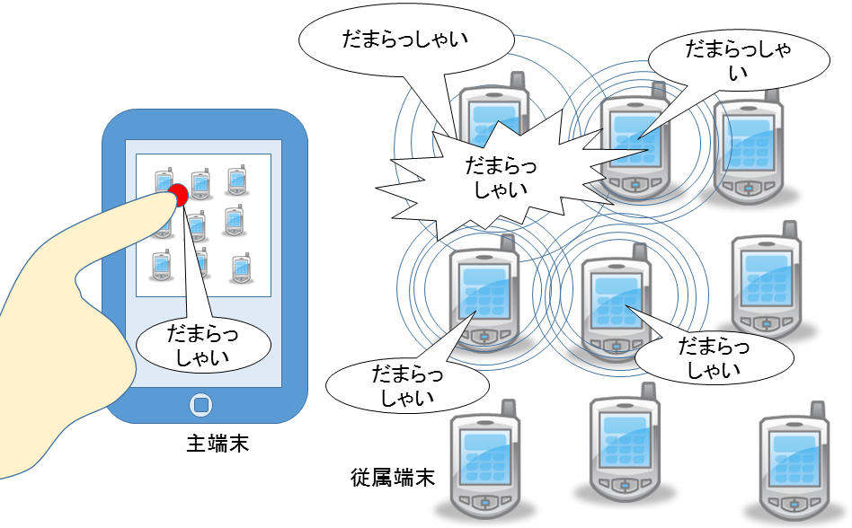

この章では，まず，提案システムで用いた
相対位置に基づく音像定位手法について触れる．
次に，その手法を実現するための
端末間の音声パルスの到達時間差による
時刻同期手法および相対距離計測手法，
そして相対位置推定手法を述べる．
さらに，パルス圧縮を用いた信号検出手法を示し，
最後に，スピーカアレイ全体の制御手法について解説する．

### DBAP法を用いた音像定位
はじめに，複数のスマートデバイスを使ってどのように音像定位するのかについて述べる．
今回のような平面配置のスピーカアレイを用いて音像定位をする手法として，
Distance-based amplitude panning (DBAP) 法がある．

- Lossius, Trond, Pascal Baltazar, and Théo de la Hogue. DBAP–distance-based amplitude panning. Ann Arbor, MI: MPublishing, University of Michigan Library, 2009.

DBAP法は，
任意の数のスピーカの位置が既知であり，
端末間のスピーカの出力特性が等しいとしたときに，
仮想音源と各スピーカとの距離から距離減衰を計算することで，
各スピーカの振幅を制御して音像を合成する手法である．

位置 $(x_s,y_s)$ にある仮想音源 $VS$ から，
位置 $(x_i,y_i)$ にある端末 $i$ への距離 $d_i$ を次のように定義する．

$$
d_i = \sqrt{(x_i - x_s)^2 + (y_i - y_s)^2} \qquad (\mathrm{for}\ 1 \leq i \leq N)
$$

DBAP法では，仮想想源の位置に関係なく，各スピーカからの音の強さの合計は

$$
I = \sum_{i=1}^N v_i^2 = 1
$$

として正規化している．
$i$ 番目のスピーカの相対的な振幅は距離に反比例するので

$$
v_i = \frac{k}{d_i^a}
$$

と定義できる．
$k$ はすべてのスピーカと仮想音源の位置に依存した係数で，

$$
k = \frac{1}{\sqrt{\sum_{i=1}^N \frac{1}{d_i^{2a}}}}
$$

である．
係数 $a$ は距離減衰係数で

$$
a = \frac{R}{20 \log_{10}2} \\
$$

と定義する．
$R$ はロールオフ係数で，受聴者と音源の距離に基づく減衰の量である．
$R=6\ [\mathrm{dB}]$ の場合は，
自由空間における距離減衰の逆二乗則に基づき，音の強さのレベルが音源からの距離が2倍になるごとに6dBずつ減少することを意味する．
また，半自由空間では $R=3\sim5\ [\mathrm{dB}]$ 程度となる．

以上のとおり，
複数のスマートデバイスが
同期的に制御でき，
端末の位置が判明しており，
端末間のスピーカの出力特性が均一であれば，
この手法を用いて音像定位ができることが分かった．

### 時刻同期と測距
基準となる時刻が違う二つの時間軸を持つ端末間において同期するには，
互いに音声パルスを出せばよい．

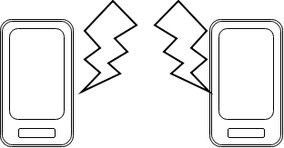

この手法はTPSN(time-sync Protocol for sensor network)

- Ganeriwal, Saurabh, Ram Kumar, and Mani B. Srivastava. "Timing-sync protocol for sensor networks." Proceedings of the 1st international conference on Embedded networked sensor systems. ACM, 2003.

などで提案されている．
原理を説明する．

端末 $A$ が自身の時刻 $t_0$ に音声パルスを発生すると，
そのパルスは音速で空間に広がり，
端末 $B$ 内の時刻 $t_1$ に受信される．
さらに，端末 $B$ からも端末 $B$ 内の時刻 $t_2$ に音声パルスを発すると，
このパルスも音速で空間に広がり，
端末 $A$ 内の時刻 $t_3$ に受信される．
ここで，図の通り，
端末 $A$ 内のパルス時間間隔 $t_3-t_0$ と
端末 $B$ 内のパルス時間間隔 $t_2-t_1$ には差が生じる．

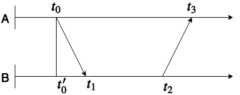

パルスの往復で伝播にかかった時間は共に等しいと仮定すると，

$$
t_0' = t_1 - \frac{(t_3 - t_0) - (t_2 - t_1)}{2} \\
$$

となり，端末 $B$ 内時刻で端末 $A$ のパルスが発せられた時刻を推定することができる．
以上が時刻同期の原理である．

音速を $c$ とすれば，副次的に端末間の距離も求まる．

$$
d_{AB} = \frac{(t_3 - t_0) - (t_2 - t_1)}{2c}
$$

端末AB間で何らかの処理を同期的に実行したい場合は
図のようにして実行すべき時間を求められる．

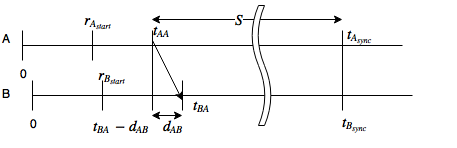

基準となる端末Aのパルスの受信時間およびその信号の伝達時間と，
それを受信してからの経過時間 $S$ をもとに，同期的に処理を実行できる．

こうして，端末間の時刻同期と距離測定ができた．

### 相対位置推定
次に，複数のスマートデバイスの空間分布をどう推定するかについて述べる．
先述のとおり，端末間の相対距離は判明している．
次の非線形最小二乗法で定式化し誤差関数を最小化する最適化問題を考える．

$$
\varepsilon(\hat{x_1}, \dots, \hat{x_N}) = \sum_{i=1}^N \sum_{j\in M(i)} \left( \| \hat{ x_i } - \hat{ x_j } \| - d_{ij} \right)^2 \\
\DeclareMathOperator*{\argmin}{arg\,min}
(\hat{x_1} \dots \hat{x_N}) = \argmin \varepsilon(\hat{x_1} \dots \hat{x_N})
$$

ここで， $N \in {\mathbb N}$ は端末の数，
$M(i) \subset \{1,\dots,N\}$ は端末 $i$ と相対距離が計測できた端末の集合，
$d_{ij} \in {\mathbb R}$ は実際に計測された端末の距離とし，
$\hat{ x_i } \in {\mathbb R}^2$ n番目の端末の位置推定値で，初期値は乱数を置く．

この問題は非線形最小二乗法と言え，
最急降下法を使って反復的に解く．更新式は次のようになる．

$$\begin{align}
\hat{x_i} (n + 1) & = \left. \hat{x_i} (n) - a \frac{\partial \varepsilon}{\partial \hat{x_i}} \right|_{\hat{x} = \hat{x}(n)} \\
\frac{\partial \varepsilon}{\partial \hat{x_i}}
&= \sum_{j\in M(i)} \frac{\partial \left( \|\hat{ x_i } - \hat{ x_j }\| - d_{ij} \right)^2}{\partial \hat{x_i}} \notag\\
&= 2 \sum_{j\in M(i)} \left( \| \hat{x_i} - \hat{x_j} \| - d_{ij} \right) \frac{\partial \| \hat{x_i} - \hat{x_j} \|}{\partial \hat{x_i}} \notag\\
&= 2 \sum_{j\in M(i)} \left( 1 - \frac{d_{ij}}{\| \hat{x_i} - \hat{x_j} \|} \right) \left( \hat{x_i} - \hat{x_j} \right).
\end{align}$$

$n$ は反復回数， $a$ は更新式のステップ幅である．

端末 $i$ が測距できた他の端末の集合 $M(i)$ は後述する信号検出により決まる．

### 信号検出
精密な測距・時刻同期のためには精密な信号検出が必要である．
信号検出の誤差は
スマートデバイスのサンプリング周波数は44100Hz
として
1サンプルあたりの時間解像度は約 1/44100 = 22.6μs
であるので，
1サンプルあたりの距離解像度は 22.6μs*340m/s=7.7mm(音速340m/sと仮定)
である．

人間の聴覚特性として，第一波面の法則という現象が知られている．
これは二つの音源からの音声が互いに50ms以上ずれると別の音源として知覚されるというものである．

- (After Helmut Haas's doctorate dissertation presented to the University of Gottingen, Gottingen, Germany as "Über den Einfluss eines Einfachechos auf die Hörsamkeit von Sprache;" translated into English by Dr. Ing. K.P.R. Ehrenberg, Building Research Station, Watford, Herts., England Library Communication no. 363, December, 1949; reproduced in the United States as "The Influence of a Single Echo on the Audibility of Speech," J. Audio Eng. Soc., Vol. 20 (Mar. 1972), pp. 145-159.)

この場合許容される誤差は
$\pm$ 50msの誤差におよそ $\pm$ 2205サンプル以内とかなり緩いものになる．
しかしながらこれでは距離誤差が $\pm$ 3.4m ととても大きなものになってしまう．
というわけで許容される誤差は音像定位よりもむしろ距離測定の手法によって定められる．
今回のような室内空間であれば，
$\pm$ 50cmの誤差つまり $\pm$ 64サンプル以内でパルスを同定できればよいとする．

そこで，そのような高精度のパルス検出をするため，
直接スペクトル拡散方式によるパルス圧縮で高いSN比を向上させ，
信号検出には通常の整合フィルタではなくピークを尖らせることができる，
フェイズオンリー整合フィルタを利用した．

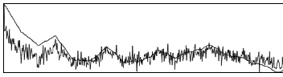

$$
\begin{align}
\mathrm{POF}[x_a, x_b]
&= \mathcal{F}^{-1}\left[\frac{\mathcal{F}\left[x_a(t)\right]^*}{|\mathcal{F}\left[x_a(t)\right]|}\mathcal{F}\left[x_b(t)\right]\right] \\
&= \mathcal{F}^{-1}\left[\frac{X_a^*(\omega)}{|X_a(\omega)|}X_b(\omega)\right]
\end{align}
$$

- Horner, Joseph L., and Peter D. Gianino. "Phase-only matched filtering." Applied optics 23.6 (1984): 812-816.

直接スペクトル拡散方式による測距システムの変復調方式を図に示す．

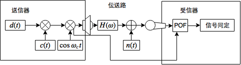

搬送波には1000Hzサイン波を，拡散符号にはM系列を用い，変調にはバイナリ位相シフトキーイング(BPSK)を使った．

復調した受信信号が雑音か有効な信号かを決定する処理を信号同定という．
伝送路における伝達関数 $H(\omega)$ において室内残響の影響
としてマルチパスによるを受けてしまう．

そこで，同期パルスを測距用信号と，伝搬路を測定する参照波としてのサウンダ(sounder)信号の二つに分離した．
同期パルスから $n$ 秒後にサウンダ信号を送り，
その二つの信号の相関を取ることで，
背景雑音とは別にパルス位置を特定することが可能になる．

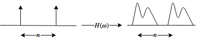

さらにサウンダ信号と測距信号は互いに異なる同周期のM系列を用いた．
サウンダ信号と測距信号を判別しやすくするためである．

この時刻が $n$ 秒ずれた二つの信号に対して時間窓で区切って相互相関をとることで，
信号が最も相関している区間，つまり信号の位置を特定することができる．
最後に，その区間相関値を閾値処理することで信号の到来を決定する．
今回は最大相関値前方での40%の相関値を超えたピークを到来時刻としている．

相関関数の計算にはウィーナー＝ヒンチンの定理を使い周波数領域での複素乗算としてFFTを使って計算することで計算量を減らすことができる．
長さの異なる信号の高速フーリエ変換には重畳加算法を使った．

- Rabiner, Lawrence R., and Bernard Gold. "Theory and application of digital signal processing." Englewood Cliffs, NJ, Prentice-Hall, Inc., 1975. 777 p. 1 (1975).

### システムクロック校正
端末のシステムクロックの進みかたはハードウェアごとに微妙に異なる．
そのため，同期してから長時間経つと，次第に端末間で遅延が生じる．
このことは，同一音源を同期的に再生し続けると，次第にずれが聞き取れるようになってくることを意味する．
この遅延を検出する手法について述べる．

端末 A のクロックを $S_A$，
端末 B のクロックを $S_B$ して，
時刻 $t$ 後に
A のサンプル数が $i$ ，
B のサンプル数が $i+d$ だけ異なっているとする．
このとき，Aを基準とした遅延比率 $S_B/S_A$ を求めたい．

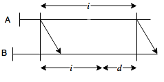

図より

$$\begin{align}
\frac{i}{S_A} &= \frac{i+d}{S_B} = t \\
\frac{S_B}{S_A} &= \frac{i+d}{i}
\end{align}$$

である．
遅延の検出においては，端末間の相対距離に変化がない限り，
端末Aが端末Bへとパルスを発生するだけで良く，
端末BはAへと返答パルスを返す必要はない．
既に同期済みでありAからBへの伝搬時間は算出済みだからである．

### 音圧校正
スマートデバイス毎にマイクロホンやスピーカのアンプ出力は異なるため，そのままではDBAP法は使えない．
ここでは，機器ごとの音圧を校正する手法を示す．

LTI(線形時不変)システムを仮定する．
$N$ 台の端末の番号を $i,j \in \{1\dots N\}$ とする．
端末 $i$ から端末 $j$ への信号伝達を考える．
$e$ を端末 $i$ で生成した単位振幅，
$v_i$ を端末 $i$ のスピーカアンプの増幅係数，
$m_j$ を端末 $j$ のマイクロホンアンプの増幅係数，
$d_{ij}=d_{ij}$ を $ij$ 間の測定距離，
$x_{ij}$ を $j$ が観測した $i$ からの信号の振幅とする．
音波の振幅は距離に反比例して減衰することが知られているので，
音声信号の伝達は

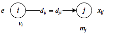

$$
e v_i \frac{1}{d_{ij}} m_j = x_{ij}
$$

とモデル化できる．
このとき，ある端末 $k$ の出力係数 $v_k$ と他の端末 $i$ の出力係数 $v_i$ との比 $v_i/v_k$ を求めたい．

$$
e v_i m_j = x_{ij}d_{ij}
$$

なので

$$\begin{align}
\frac{e v_j m_j}{e v_k m_j} &= \frac{x_{ij} d_{ij}}{x_{kj} d_{kj}} \\
\frac{v_j}{v_k} &= \frac{x_{ij} d_{ij}}{x_{kj}d_{kj}} \\
\end{align}$$

である．
観測した振幅 $x_{ij}$ および測定距離 $d_{ij}$ は誤差を含むので，
それらを平均した $\hat{v_i}$ は

$$
\frac{\hat{v_i}}{v_k} = \frac{1}{N} \sum_{i\neq j \neq k} \frac{x_{ij} d_{kj}}{x_{kj}d_{ij}} \\
$$

と定義できる．$d_{ii}$ のときは距離が0となりゼロ除算が発生するので，
$i\neq j \neq k$ としている．

一番出力の低い端末 $k$ の出力係数 $v_k$ を基準とすることで，
すべての端末において定格出力を守ることができる．

### 隣接ノードでない端末間の同期，音圧校正，クロック校正
互いに互いの信号を検出できなかったノード間での校正を考える．
図に隣接ノードではない端末を含むネットワークを示す．

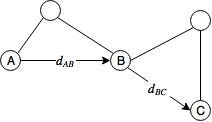

このとき端末 A と端末 C 間では同期・測距ができていないが，
互いに端末 B とは同期・測距できているという状況である．

#### 同期
時刻の基準となる
端末 $A$ がパルスを発した時間を $t_{AA}$ として
そのパルスが端末 $B$ に届いた時間は $t_{AB}$ とする．
また，
端末 $B$ がパルスを発した時間を $t_{AB}$ として
そのパルスが端末 $C$ に届いた時間は $t_{BC}$ とする．
そしてそれぞれの伝達時間を $d$ とすると図のようになる．

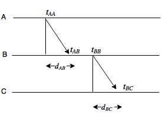

このとき，まず端末 $C$ は端末 $B$ と同期して，
その後端末 $B$ と端末 $A$ の時刻ずれ情報をもとにさらに端末 $A$ との同期ができる．

#### 音圧校正

端末 $A$ を基準に音圧校正を考えると

$$
\frac{v_B}{v_A} = \frac{x_{iB} d_{iB}}{x_{AB}d_{AB}} \\
\frac{v_C}{v_B} = \frac{x_{iC} d_{iC}}{x_{BC}d_{BC}} \\
$$

であるので

$$
\frac{v_C}{v_A} =
\frac{v_B v_C}{v_A v_B} =
\frac{x_{iB} x_{iC} d_{iB} d_{iC}}{x_{AB} x_{BC} d_{AB} d_{BC}}
$$

とすれば端末 A と端末 C の出力比率を求められる．

### 同期・測距・校正手法のための制御システム
同期のためには複数の端末がパルスを出し合わなければならないが，
いつどの端末がパルスを出すのか，といったスケジューリングをどうするかについて述べる．

図にシステム全体のネットワーク構成を示す．

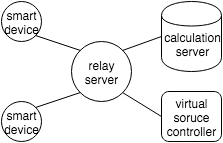

基本的には端末間の通信を中継するリレーサーバを中心としたスター型ネットワークである．
また，スピーカアレイに参加しない特別なノードとして，
計算用ノードと仮想音源を設定する制御用ノードがある．

次の図に同期・測距するまでのシステムフローを示す．

今回の実装では中継サーバが同期アルゴリズムを制御している．
すべてのコマンドはリクエスト-レスポンスで成り立っており，リクエストを受けた端末は必ずレスポンスを返さねばならない．
まず，中継サーバはスピーカアレイを構成する端末に対して ping コマンドを送信し，
アレイに参加できる端末を確認する．
次に，全端末に対して録音をするように beginRec コマンドを送信する．
そして，各端末の放つパルスが排他的になるように，
パルスを放つ端末ごとにstartPulse，beepPulse，stopPulseコマンドを繰り返し送信する．
startPulseとstopPulseコマンドは，
この時間区間内にいずれかの端末からパルスが発信されることを示すもので，
後にパルス位置を検出するときの計算量を減らすためのコマンドである．
beepPulseは任意の一台の端末に対して，パルスを送信するように促すコマンドである．

そしてすべての端末が互いに排他的にパルス発生し終えると，
最後にstopRecという録音終了コマンドを送信する．
その後，collectコマンドで各端末が録音したデータを集計し，
計算用サーバへ送信する．
計算用サーバは，それぞれの端末間のパルスの受信時刻を
先述の手法で検出し，相対信号伝達時間と相対距離計測，空間配置推定する．
その後，それらの情報を中継サーバを介して制御用端末へ送信する．

### 仮想音源配置によるDBAPアレイスピーカ制御システムUI

仮想音源を配置し制御するための端末のユーザインターフェースを示す．

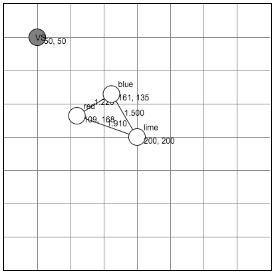

図のように推定した端末の分布図と，仮想音源を表示する．
仮想音源VSをドラッグすることで，DBAP法によって出力する振幅を計算し，各端末へ振幅を配信することで音像定位する．
当然，音を鳴らしながら音源を移動させることも可能である．

## 既知の問題
既知の問題としては，Nexus7が録音中に頻繁にバッファを取りこぼすことが挙げられる．

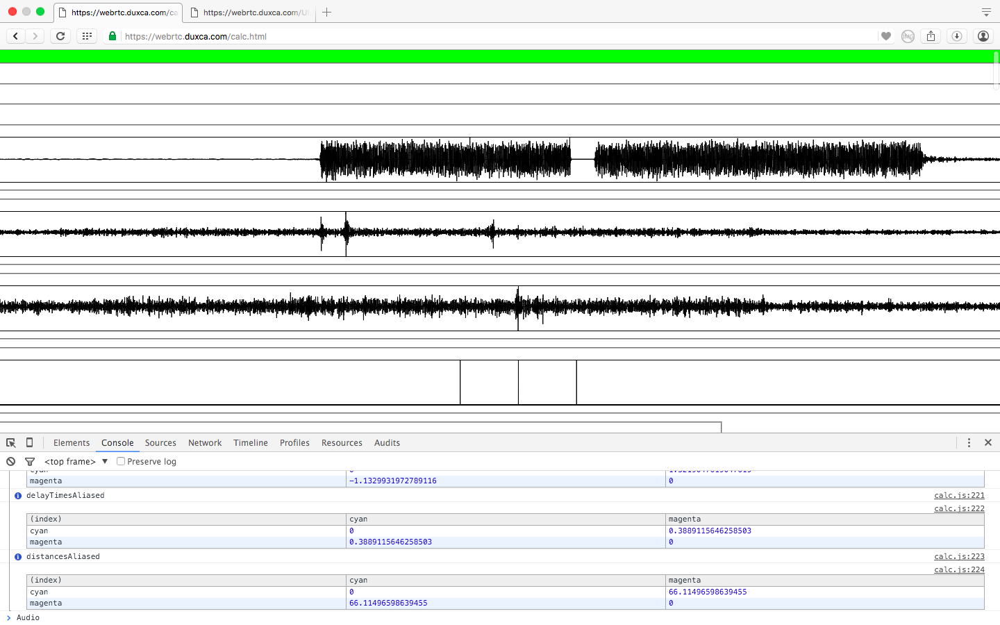

この現象によりパルスが到来した時刻が分からないので，上記手法が使えなかった．
原因はハードウェアにあるのかOSにあるのかブラウザの実装にあるのか不明であり，現在調査中である．
MacBookAirとMacBookPro間では同期に成功している．

他には，TDMAのみではN回の排他的パルス送信が必要で同期に時間がかかるという問題がある．
これにはスペクトル拡散を使っているのでCDMA（Code Division Multiple Access)化できる余地があるが，
今までの実験で，Nexus7ではGold符号でBPSKした信号が重なったときに，
分離検出できないという問題があったため，開発は滞っている．

## 実験
(Nexus7がダメなので実験できませんでした)

* 2端末間での | 碁盤状に並べた時の
  * 信号検出性能、距離、ダイレクトパスなしなどの状況を変えて
  * 同期手法の有効性
  * DBAP法の有効性
  * 音圧校正手法の有効性
  * クロックずれ校正手法の有効性
  * 隣接ノードでない端末間の各種手法の有効性

## デモ
* MacBookかつGoogleChromeを使ってる人向け
* https://webrtc.duxca.com

## 結論
以上の通り，スマートデバイスを用いて
DBAP法を用いたスピーカアレイを構築できることを示した．

## その他の話題
* エコー拡散法による音声透かし使った同期も試みた
  * 生バイナリからはデータを取り出すことができたが、実空間ではできなかった
    * 非線形ひずみの可能性
* Gold符号使ったCDMAも試みた
  * 生バイナリでは信号抽出できたが、実空間ではできなかった
    * 非線形ひずみの可能性

## 用語解説

### 回帰，曲線当てはめ
* 回帰の一つの手法が最小二乗法

### 最小二乗法，非線形最小二乗法
* 非線形最小二乗法は
* 反復的解放（数値解法）のひとつが最急降下法
* 最小2乗法の最適なパラメータを線形方程式を解かないで，反復解法で解く

### 反復解法，最急降下法，ニュートン法，
* 最急降下法は適当な初期パラメータからはじめて，パラメータ の値を微分値と逆の方向にちょっとだけ変化させて徐々に最適なパラメータに 近づけて行く方法

### MDS,非計量MDS
多次元尺度構成法
Multi Dimensional Scaling
non-metric MDS
MDSは解析的，
非計量MDSは最小二乗法を用いて当てはめ
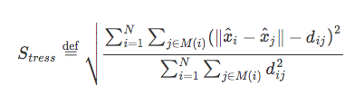

### 畳み込み積分

### 自己相関関数，相互相関関数

### FT,DFT,FFT

### 畳み込み定理

### ウィーナー＝ヒンチンの定理
FFTによる相互相関

* 整合フィルタは元信号と受信信号の相互相関
* 相互相関の計算にはFFTを使うことで高速化できる

### 重畳加算法
長さの違う二つの信号をFFTする手法としてためオーバーラップ加算法を用いた

### 信号の線形性
LTIシステム

### インパルス応答，伝達関数，残響
時刻 $t=0$ に Diracのデルタ関数(インパルス)をシステムに入力したときの
応答をインパルス応答という．
インパルス応答を周波数領域で表現したものを伝達関数と呼ぶ．

システムへの入力信号を $x(t)$ ，
インパルス応答を $h(t)$ ，
システムからの出力信号を $y(t)$ とおくと，

$$
y(t) = x(t) * h(t)
$$

である．ここで演算子 $*$ は畳み込み積分を表す．
また，この式を周波数領域で表現すると，

$$
Y(\omega) = X(\omega)H(\omega)
$$

となる．

### LPF

##### 整合フィルタ(matched filter)
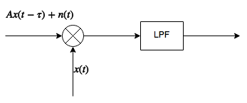
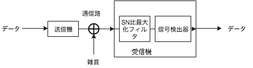

- パルスを検出する最良のフィルタ
  - 変調信号とおなじ信号を畳み込むフィルタ
  - BPSKされたDSSSを復調するにはMFが使われる
$$
\begin{align}
\mathrm{MF}[x_a, x_b]
&= \mathcal{F}^{-1}\left[\mathcal{F}\left[x_a(t)\right]^*\mathcal{F}\left[x_b(t)\right]\right] \\
&= \mathcal{F}^{-1}\left[X_a^*(\omega)X_b(\omega)\right]
\end{align}
$$

### Phase-only Filter

今回は距離測定のために精密なパルス時刻検出が必要なためピークを尖らせることができるMFの派生であるPOFを使った
$$
\begin{align}
\mathrm{POF}[x_a, x_b]
&= \mathcal{F}^{-1}\left[\frac{\mathcal{F}\left[x_a(t)\right]^*}{|\mathcal{F}\left[x_a(t)\right]|}\mathcal{F}\left[x_b(t)\right]\right] \\
&= \mathcal{F}^{-1}\left[\frac{X_a^*(\omega)}{|X_a(\omega)|}X_b(\omega)\right]
\end{align}
$$

### 二次レーダーと距離計測

### サンプリング周波数と距離分解能

### SN比

### パルス圧縮

精密に時刻同期をするためには，精密にパルス到来時刻を検出する必要がある．
理想的には，パルスはデュラックの $\delta$ 関数のような，鋭いピークを持つものが望まれるが，
そのような尖頭電力が大きく幅の狭いパルスは，
入出力するハードウェアの制約により送信が困難である．
そこで，電力が低く継続時間の長いパルスを送信した後，
受信する際に信号処理をすることで，
尖頭電力が大きく幅の狭いパルスの送信したのと同じ効果を得ることができる．
この信号処理をパルス圧縮という．

単一パルス，繰り返しパルス，チャープ，バーカー符号
チャープレーダー
TSPによるインパルス応答測定
DSSSによりパルス圧縮できる．

- パルスの曖昧さを減らす必要がある
  - SN比が大きな信号が必要
    - **パルス圧縮** が必要

- よいパルス
  - 大電力，高SN比，鋭いピーク
  - 理想的にはデルタ関数
- 現実問題として
  - そんな電力がない，機械が壊れる
- パルス圧縮は時間方向，周波数方向へエネルギーを拡散させるしくみ
- 自己相関の結果がディラックのデルタ関数に近い信号がパルス圧縮に向いている

あいまい度

### マルチパスフェージング

反射・残響

* 反射・回折によりピークが複数現れる，互いに弱め合うなどの現象
* 回折して届いた第一波よりも
  壁に反射して届いた第二波の方が信号強度が高いなどの問題

信号同定が困難

### 信号同定
センサから得られた計測値に対して，
機械が計測対象の状態を自動判定することを信号同定(システム同定)という．
信号同定においては何らかの規範となるモデルが必要であり，
経験などから得られた知識をもとにモデルを構築する．
例えば，音圧の計測値が一定の閾値を超えることで，パルスが到来したなどを判定する．

### 変調方式

### PSK，BPSK
バイナリ位相シフトキーイング

### 直接スペクトル拡散方式
このM系列符号をBPSKしたものを直接スペクトル拡散方式という．

DSSSによりパルス圧縮できるので測距にも使われてる

* (direct sequence spread spectrum: DSSS)
* 狭帯域ベースバンドに対して擬似乱数でBPSKすることで周波数領域に拡散

### 多元接続とTDMA,CDMA

### PN系列，M系列，LFSR
PN(pseudo noise，擬似雑音)系列とは，擬似乱数の一種である．
最も代表的なPN系列として，M系列(Maximum length shift register 最大周期シフトレジスタ)が知られている．
これは，図のような排他的論理和(XOR)による帰還タップをもつ，
線形シフトレジスタ(Linear Feedback Shift Register: LFSR)に，
すべてゼロ以外の初期値を与えることにより生成される周期系列である．
（直和記号⊕を使っているのはLFSRのXORが有限体 $\mathrm{GF}(2)$ 上の加法演算とみなせるからである．）

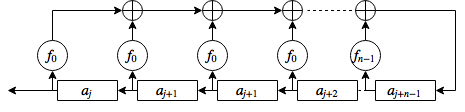

周期 $N$ のM系列の自己相関関数は，
サイドローブレベルは $1/N$ となり，
位相差 $N$  ごとにピーク $N$ を持つ．
また，周期長 $N$ はLSFRのタップ数 $n$ で決定され，
$$
N = 2^n - 1
$$
で与えられる．

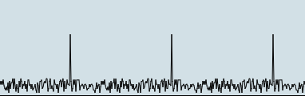

* M系列(最大化系列)
* $2^n-1$ の系列
* 自己相関が $2^n-1$ のときに $n$ になる性質

### 有限体と特性多項式

### 音像定位

人間の知覚特性
ITD,ILD
左右，上下，距離
頭部伝達関数

### ハース効果，第一波面効果
両耳相関度

### 音の広がり知覚，ASWとLEW
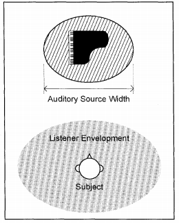

### 波動方程式の導出
1次元の波動方程式とその一般解を導出する．
波動は媒質を通して伝搬するが，1次元方向には，
波は形を変化させず伝搬するとし，
空間座標 $x$ と時間座標 $t$ 上の波動の振幅が
スカラ量で示されるとすると，伝搬する波動は，

$$
u(x, t) = f(x - ct) \tag{1}
$$

または

$$
u(x, t) = f(x + ct) \tag{2}
$$

と表現できる．
音波の場合，$u$ で示されるのは，例えば，標準大気圧からの圧力変動分である．
波の伝搬速度 $c$ の媒質中で $t=0$ のときに $x=x_0$ であった波が，
$t=t_0$ のときに $x=x_0+xt_0$ に移動することを考える．
これは式 $(1)$ を用いると $u(x_0, 0)=f(x_0)=u(x_0+ct_0, t_0)$ であり，正の方向に伝搬速度 $c$ で伝搬する波を表現している．
同様に式 $(2)$ は負の方向に伝搬している波を表す．

$v = x \mp ct$ とおけば

$$\begin{align}
\frac{\partial u}{\partial x}
&= \frac{\partial u}{\partial v} \\
\frac{\partial^2 u}{\partial x^2}
&= \frac{\partial^2 u}{\partial v^2}
\end{align}$$

であり

$$\begin{align}
\frac{\partial u}{\partial t}
&= \pm c \frac{\partial u}{\partial v} \\
\frac{\partial^2 u}{\partial^2 t}
&= c \frac{\partial^2 u}{\partial v^2}
\end{align}$$

これらを整理すると

$$
\frac{\partial^2 u}{\partial x^2}
= \frac{1}{c^2} \frac{\partial^2 u}{\partial t^2}
$$

となる．
これが，1次元の波動方程式である．
この波動方程式を3次元に拡張すると

$$
\frac{\partial^2 u}{\partial x^2} +
\frac{\partial^2 u}{\partial y^2} +
\frac{\partial^2 u}{\partial z^2}
= \frac{1}{c^2} \frac{\partial^2 u}{\partial t^2}
$$

となる．
微分作用素 $\nabla^2$ を用いれば，

$$
\nabla^2 u =
\frac{1}{c^2}
\frac{\partial^2 u}{\partial t^2} \tag{1}
$$

と表せる．

### 波動方程式の一般解の導出

### 極座標形式のラプラシアンの導出

### 球面波の音圧の距離減衰
球面波における音圧は距離に反比例して減衰することを示す．
波動方程式

$$
\nabla^2 u =
\frac{1}{c^2}
\frac{\partial^2 u}{\partial t^2} \tag{1}
$$

において，ラプラシアン $\nabla^2$ を極座標で表すと

$$
\nabla^2 =
\frac{\partial^2}{\partial r^2}
+ \frac{2}{r} \frac{\partial}{\partial r}
+ \frac{1}{r^2\sin\theta}
\frac{\partial}{\partial \theta}
\left(
\sin\theta
\frac{\partial}{\partial \theta} \right)
+ \frac{1}{r^2\sin^2\theta}
\frac{\partial^2}{\partial \phi^2}
$$

である．
球面波では，

$$
\frac{\partial u}{\partial \theta} = 0, \quad
\frac{\partial u}{\partial \phi} = 0
$$

であるから，

$$\begin{align}
\nabla^2 u
&= \frac{\partial^2 u}{\partial r^2}
+ \frac{2}{r} \frac{\partial u}{\partial r}  \tag{2}\\
\end{align}$$

となる．
ここで積の偏微分公式

$$
\frac{\partial}{\partial x}\left(fg\right) =
\left(\frac{\partial f}{\partial x}\right) g
+ f \left(\frac{\partial g}{\partial x}\right)
$$

より

$$\begin{align}
\frac{\partial^2}{\partial r^2} \left(ru\right)
&= \frac{\partial}{\partial r} \left(\left(\frac{\partial r}{\partial r}\right) u
+ r \left(\frac{\partial u}{\partial r}\right)\right) \\
&= \frac{\partial}{\partial r} \left(
  u + r \frac{\partial u}{\partial r}
  \right) \\
&= \frac{\partial u}{\partial r}
  + \frac{\partial u}{\partial r}
  + r \frac{\partial^2 u}{\partial r^2} \\
&= 2 \frac{\partial u}{\partial r}
  + r \frac{\partial^2 u}{\partial r^2} \tag{3}\\
\end{align}$$

となるので， $(2)$ 式は $(3)$ を使って

$$\begin{align}
\nabla^2 u
&= \frac{\partial^2 u}{\partial r^2}
+ \frac{2}{r} \frac{\partial u}{\partial r} \\
&= \frac{1}{r} \frac{\partial^2}{\partial r^2} (ru)
\end{align}$$

と表せる．これを $(1)$ 式に代入し，整理すると，

$$\begin{align}
\nabla^2 u
&= \frac{1}{c^2} \frac{\partial^2 u}{\partial t^2} \\
\frac{1}{r} \frac{\partial^2}{\partial r^2} (ru)
&= \frac{1}{c^2} \frac{\partial^2 u}{\partial t^2} \\
\frac{\partial^2}{\partial r^2} (ru) &=
\frac{1}{c^2}
\frac{\partial^2}{\partial t^2} (ru) \tag{4}
\end{align}$$

を得る．
これは一次元の波動方程式

$$\begin{align}
\frac{\partial^2 u}{\partial x^2}
&= \frac{1}{c^2} \frac{\partial^2 u}{\partial t^2}
\end{align}$$

と同じ形であるので，
一次元の波動方程式の一般解

$$\begin{align}
u(x, t) &= f(x-ct)+g(x+ct)
\end{align}$$

より，

$$\begin{align}
ru &= u_1(x-ct) + u_2(x+ct) \\
u &= \frac{1}{r}u_1(x-ct) + \frac{1}{r}u_2(x+ct)
\end{align}$$

という解を持つ．
右辺第1項は原点から速さ $c$ であらゆる方向に広がる球面波を，
第2項はあらゆる方向から原点に向かって集まってくる球面波を表している．
$1/r$ という係数は，
波の振幅が $r$ に反比例して減少することを示している．
$u_1, u_2$ は任意の関数であるので，球面波では振幅は減少するが，
波形は変化しないことを示している．

### 音圧レベルの減衰
