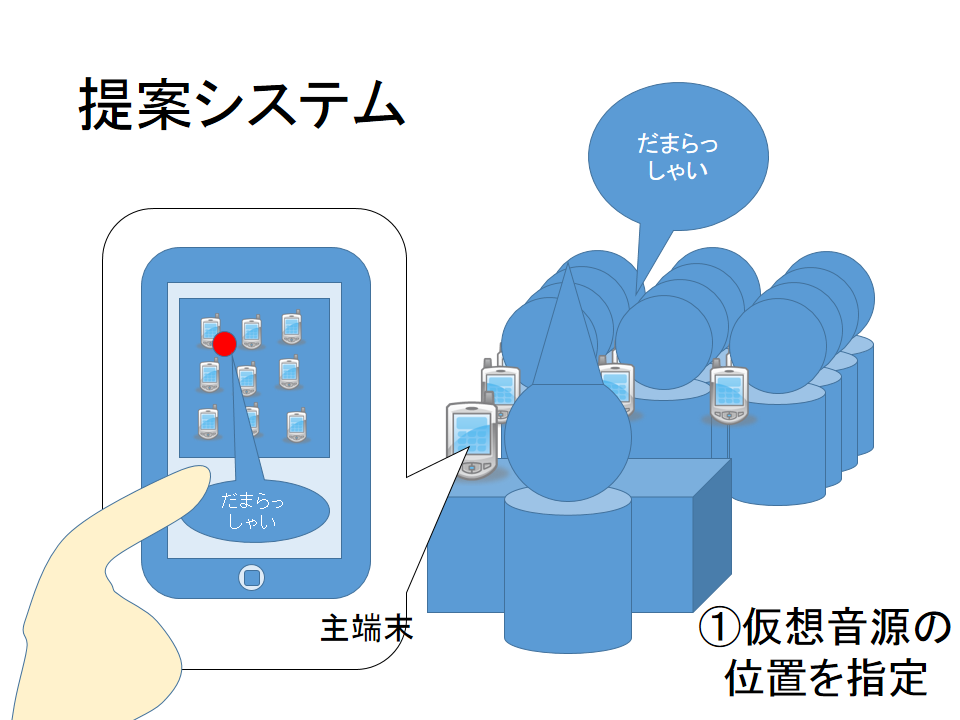
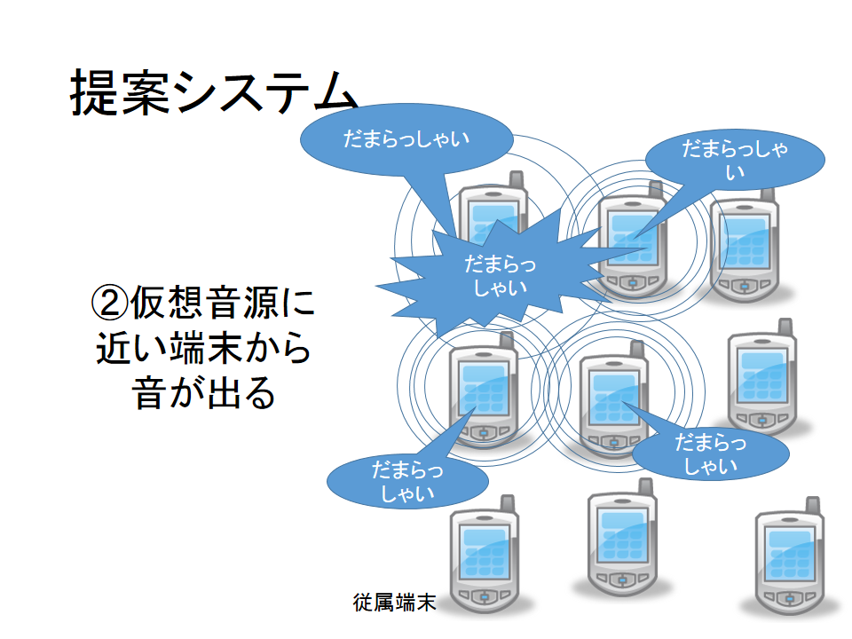
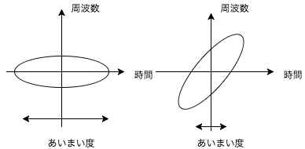
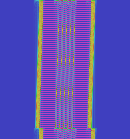
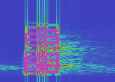
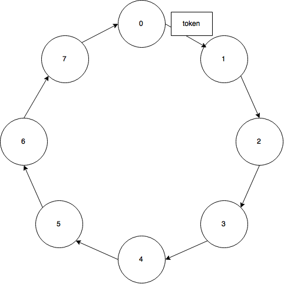
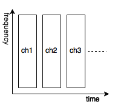
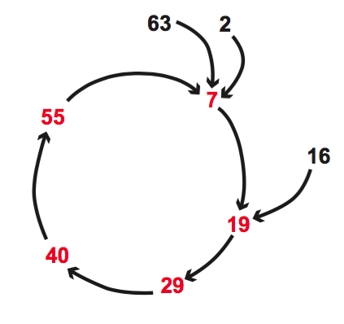
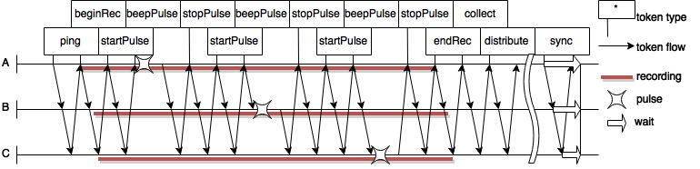

# 複数の携帯端末による教室空間の空間音響環境構築手法の検討

---

## 概説

- 個人が所有するスマートデバイスを用いて
- 空間音響を構築し相互の位置に応じた
- 音による情報提供を行うシステムを開発

#### 先行研究のダメな点

#### TSPをパルス圧縮につかう
- <small>音の発信を利用したキャリブレーションに基づくアドホックマイクロホンアレイによる音源定位</small>
  - TSPはインパルス応答に使われる手法
  - エネルギーは圧縮されるがあいまい度が大きくなる

#### チャープ信号使ってるけど帯域が狭い、分散してる

- <small>複数周波数帯を用いた携帯端末における位置推定手法の研究</small>
  - スマートデバイスの使える**帯域は狭く**、また機器によって周波数応答がまちまち

### 想定

- 教室にいるたくさんの人々のスマートデバイス
- スピーカを同期的に制御
- 特定の位置に仮想音源を配置
- 音による注視効果狙う
- 例：教室空間で屁の音が聞こえた時

### 

### 

### 研究背景

- 生活空間へのスマートデバイスの普及
- 複数端末を利用したシステム構築の試み
- 例： Wireless Acoustic Sensor Networks
  - BeepBeep: A High Accuracy Acoustic Ranging System using COTS Mobile Devices[Chunyi Peng]

身近なスマートデバイスを用いて色々できる時代になった

### そこで

- スマートデバイスのマイクロホンとスピーカを利用
- 音声信号で相対位置を把握
- スピーカアレイを構築

**音像定位**しよう

## 提案システムのしくみ

### 状況設定

- 教室空間
- 各々の机の上にスマートデバイス
- 各端末が同期的に音声を発信
- 音像定位する

という状況を想定

### 

### 

### 必要な技術
- 音像定位
  - 同期的制御
    - 端末間同期
  - 相対位置推定
    - 測定用信号処理

#### パルス圧縮の例：バーカー符号
- パルス圧縮の一種、時間方向へ圧縮
- JAXA精測レーダー、無線LAN、WiMAX
- 長さ$N$の有限長系列で、同期点以外での自己相関関数の絶対値の最大が$1/N$となるもの
- ディラックの$\delta$関数に近い理想的な相関特性を持つ。

#### パルス圧縮の例：チャープ信号

- パルス圧縮の一種、パルスを周波数方向へ変調
- より狭い範囲にエネルギーを集中できる

#### パルス圧縮の例：チャープ信号

##### 前回の手法：チャープ信号+バーカー符号+BPSK
- 独自のパルス圧縮手法
- より強力なパルス圧縮
  - チャープ信号をバーカー符号を用いてBPSKで周波数変調
    - 二重の圧縮
- TDMA方式で帯域の有効活用(後述
  - 各端末が**全帯域を目一杯つかう**ことで強力なパルス圧縮

#### 前回の手法：独自のパルス圧縮手法
  

#### 前回の手法：スペクトルグラム

- 左：論理値
- 右：スマートデバイスの拾った信号

#### 前回の手法：Binary phase-shift keying(BPSK)

- 位相0を0、位相πを1とする
- 整合フィルタで検出できる

##### 前回の手法：チャープ信号+バーカー符号の問題点
* TDMAしかできない
* バーカー符号が最大13
* チャープ信号をBPSKはあまり見かけない

##### TDMA+トークンリング+Chord

##### TDMA+トークンリング+Chord
* TDMAの時間の分散排他制御にリングネットワークを使用
* リングネットワークの構築にはChordを使用
* WebRTC P2Pで(TDMA進行)サーバいらず(P2Pシグナリングサーバは必要)
* 各端末で並列計算

###### 前回までのしくみ Time Division Multiple Access

- パルス圧縮は周波数領域を専有する
- バースト信号で時間を分割
- TDMAを用いれば各デバイスに目一杯帯域を割り振れる

###### 前回までのしくみ 分散排他
- 時間を分割とは、つまり時間の排他制御
  - 排他制御といえばトークンリング

###### 前回までのしくみ Chord DHT

- Join と Stabilizeという２つのアルゴリズムでP2Pリングネットワークを構築
- トークンリングのトークンをバースト信号として利用

##### 前回までのしくみ

* 3端末でぐるぐると処理を回す

##### 前回の問題点
* P2P接続のためのWebRTCがHTTPSでしか使えなくなった
  * HTTPSサーバを立てるコストが高いので実験環境つくれない
* FFTの計算が重くてNexus7(2013)がフリーズ

#### 今回の手法

#####
