# 複数の携帯端末による教室空間の空間音響環境構築手法の検討

---

## 概説

- 個人が所有するスマートデバイスを用いて
- 空間音響を構築し相互の位置に応じた
- 音による情報提供を行うシステムを開発

#### 先行研究のダメな点

#### TSPをパルス圧縮につかう
- <small>音の発信を利用したキャリブレーションに基づくアドホックマイクロホンアレイによる音源定位</small>
  - TSPはインパルス応答に使われる手法
  - エネルギーは圧縮されるがあいまい度が大きくなる

#### チャープ信号使ってるけど帯域が狭い、分散してる

- <small>複数周波数帯を用いた携帯端末における位置推定手法の研究</small>
  - スマートデバイスの使える**帯域は狭く**、また機器によって周波数応答がまちまち

### 想定

- 教室にいるたくさんの人々のスマートデバイス
- スピーカを同期的に制御
- 特定の位置に仮想音源を配置
- 音による注視効果狙う
- 例：教室空間で屁の音が聞こえた時

### 

### 

### 研究背景

- 生活空間へのスマートデバイスの普及
- 複数端末を利用したシステム構築の試み
- 例： Wireless Acoustic Sensor Networks
  - BeepBeep: A High Accuracy Acoustic Ranging System using COTS Mobile Devices[Chunyi Peng]

身近なスマートデバイスを用いて色々できる時代になった

### そこで

- スマートデバイスのマイクロホンとスピーカを利用
- 音声信号で相対位置を把握
- スピーカアレイを構築

**音像定位**しよう

## 提案システムのしくみ

### 状況設定

- 教室空間
- 各々の机の上にスマートデバイス
- 各端末が同期的に音声を発信
- 音像定位する

という状況を想定

### 

### 

### 必要な技術
- 音像定位
  - 同期的制御
    - 端末間同期
  - 相対位置推定
    - 測定用信号処理

---

### 音像定位

#### 複数のスマートデバイスを使って どのように音像定位するのか

#### Distance-based amplitude panning (DBAP) 法
* 任意の数のスピーカの位置が既知
* 仮想音源と各スピーカとの距離から距離減衰を計算
* 各スピーカの音の大きさで音像定位(振幅パニング)

仮想音源とスピーカの距離

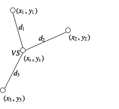
$$
d_i = \sqrt{(x_i - x_s)^2 + (y_i - y_s)^2} \qquad (\mathrm{for}\ 1 \leq i \leq N)
$$

仮想想源の位置に関係なく、各スピーカからの音の強さは
$$
I = \sum_{i=1}^N v_i^2 = 1
$$
と仮定

$i$ 番目のスピーカの相対的な振幅は距離に反比例して
$$
v_i = \frac{k}{d_i^a}
$$

ここで
$$
k = \frac{1}{\sqrt{\sum_{i=1}^N \frac{1}{d_i^{2a}}}}
$$
$k$ はすべてのスピーカと仮想音源の位置に依存

$$
a = \frac{R}{20 \log_{10}2} \\
$$
* 係数 $a$ は、距離減衰係数
* $R=6\ [\mathrm{dB}]$ の場合
  * 音の強さのレベルが、音源からの距離が2倍になるごとに6dBずつ減少
  * 自由空間における距離減衰の逆二乗則に基づき、
* 半自由空間では $R=3\sim5\ [\mathrm{dB}]$

---

### 同期・測距・位置推定

#### 複数のスマートデバイスの空間分布を どう推定するか

#### 距離・同期

- 二次レーダーのしくみを使う
  - 質問信号と応答信号の時間差から距離を求める
  - 同期と同じしくみでできる

#### 同期について
- 質問信号と応答信号の時間差で同期できる
  - <small>Timing-sync Protocol for Sensor Networks[Saurabh Ganeriwal]</small>
  - <small>BeepBeep: A High Accuracy Acoustic Ranging System using COTS Mobile Devices[Chunyi Peng]</small>
- $t_0'$ の時刻を推定

#### 同期と測距は同じ手法が使える
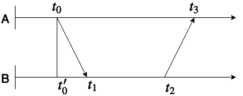
$$
t_0' = t_1 - \frac{(t_3 - t_0) - (t_2 - t_1)}{2} \\
d_{AB} = \frac{(t_3 - t_0) - (t_2 - t_1)}{2c}
$$

### 相対位置推定
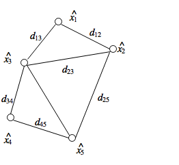
* 相対距離行列から端末の空間分布を推定
* 通常は多次元尺度法(MDS)が使われる
* 今回のように計測に誤差が伴うものには非線形MDSを使う

#### 非線形MDSは最小二乗法

* 推定位置と計測相対距離の誤差を最小二乗法で最適化
* 初期位置はランダム
$$
\varepsilon(\hat{x_1}, \dots, \hat{x_N}) = \sum_{i=1}^N \sum_{j\in M(i)} \left( \| \hat{ x_i } - \hat{ x_j } \| - d_{ij} \right)^2 \\
\DeclareMathOperator*{\argmin}{arg\,min}
(\hat{x_1} \dots \hat{x_N}) = \argmin \varepsilon(\hat{x_1} \dots \hat{x_N})
$$

##### 更新関数の詳細
$$\begin{align}
\hat{x_i} (n + 1) & = \left. \hat{x_i} (n) - a \frac{\partial \varepsilon}{\partial \hat{x_i}} \right|_{\hat{x} = \hat{x}(n)} \\
\frac{\partial \varepsilon}{\partial \hat{x_i}}
&= \sum_{j\in M(i)} \frac{\partial \left( \|\hat{ x_i } - \hat{ x_j }\| - d_{ij} \right)^2}{\partial \hat{x_i}} \notag\\
&= 2 \sum_{j\in M(i)} \left( \| \hat{x_i} - \hat{x_j} \| - d_{ij} \right) \frac{\partial \| \hat{x_i} - \hat{x_j} \|}{\partial \hat{x_i}} \notag\\
&= 2 \sum_{j\in M(i)} \left( 1 - \frac{d_{ij}}{\| \hat{x_i} - \hat{x_j} \|} \right) \left( \hat{x_i} - \hat{x_j} \right).
\end{align}$$
---

### 信号検出

#### 精密な測距・時刻同期のためには精密な信号検出が必要

#### 許容される信号検出の誤差
* スマートデバイスのサンプリング周波数は44100Hz
* 1サンプルあたりの時間解像度は約 1/44100 = 22.6μs
* 1サンプルあたりの距離解像度は 22.6μs*340m/s=7.7mm(音速340m/sと仮定)
* $\pm$ 1msの誤差におよそ $\pm$ 5サンプル以内
* $\pm$ 30cmの誤差におよそ $\pm$ 4サンプル以内

#### 精密な時刻同期のためには

- パルスの曖昧さを減らす必要がある
  - SN比が大きな信号が必要
    - **パルス圧縮** が必要

#### パルス圧縮とは
- よいパルス
  - 大電力、高SN比、鋭いピーク
  - 理想的にはデルタ関数
- 現実問題として
  - そんな電力がない、機械が壊れる
- パルス圧縮は時間方向、周波数方向へエネルギーを拡散させるしくみ
- 自己相関の結果がディラックのデルタ関数に近い信号がパルス圧縮に向いている

#### パルス圧縮の例：バーカー符号
- パルス圧縮の一種、時間方向へ圧縮
- JAXA精測レーダー、無線LAN、WiMAX
- 長さ$N$の有限長系列で、同期点以外での自己相関関数の絶対値の最大が$1/N$となるもの
- ディラックの$\delta$関数に近い理想的な相関特性を持つ。

#### パルス圧縮の例：チャープ信号

- パルス圧縮の一種、パルスを周波数方向へ変調
- より狭い範囲にエネルギーを集中できる

#### パルス圧縮の例：チャープ信号

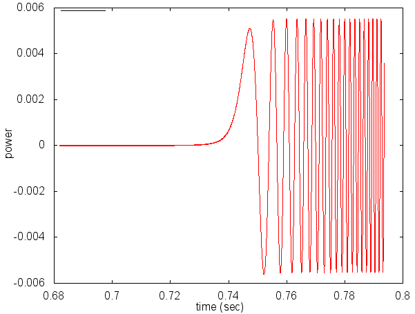

##### 前回の手法：チャープ信号+バーカー符号+BPSK
- 独自のパルス圧縮手法
- より強力なパルス圧縮
  - チャープ信号をバーカー符号を用いてBPSKで周波数変調
    - 二重の圧縮
- TDMA方式で帯域の有効活用(後述
  - 各端末が**全帯域を目一杯つかう**ことで強力なパルス圧縮

#### 前回の手法：独自のパルス圧縮手法
  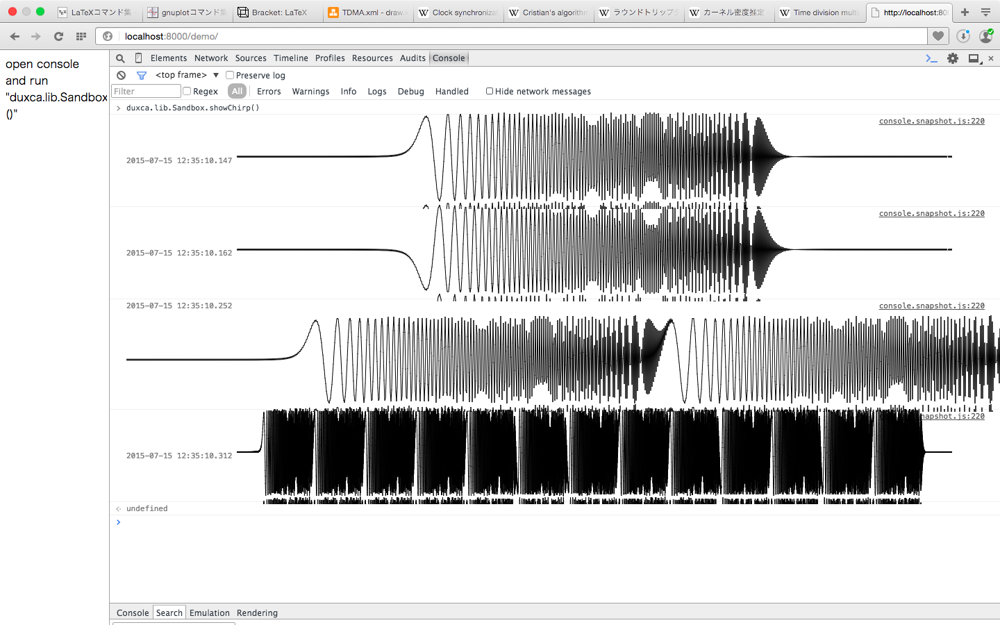

#### 前回の手法：スペクトルグラム

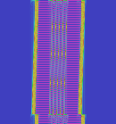
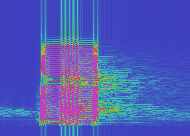

- 左：論理値
- 右：スマートデバイスの拾った信号

#### 前回の手法：Binary phase-shift keying(BPSK)

- 位相0を0、位相πを1とする
- 整合フィルタで検出できる

##### 前回の手法：チャープ信号+バーカー符号の問題点
* TDMAしかできない
* バーカー符号が最大13
* チャープ信号をBPSKはあまり見かけない

##### 今回：擬似乱数による直接スペクトル拡散方式
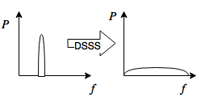
* (direct sequence spread spectrum: DSSS)
* 狭帯域ベースバンドに対して擬似乱数でBPSKすることで周波数領域に拡散
* CDMA（Code Division Multiple Access)化できる余地がある（開発中

##### 擬似乱数の発生方法

* M系列(最大化系列)
* $2^n-1$ の系列
* 自己相関が $2^n-1$ のときに $n$ になる性質

##### DSSSの処理過程
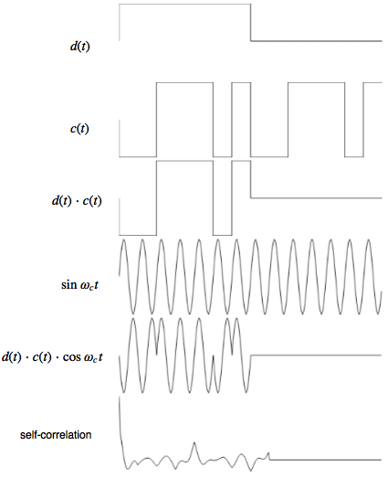

##### DSSSの変復調方式
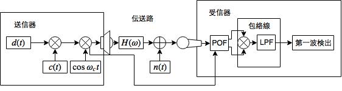

##### 整合フィルタ(matched filter)
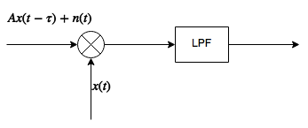
- パルスを検出する最良のフィルタ
  - 変調信号とおなじ信号を畳み込むフィルタ
  - BPSKされたDSSSを復調するにはMFが使われる
$$
\begin{align}
\mathrm{MF}[x_a, x_b]
&= \mathcal{F}^{-1}\left[\mathcal{F}\left[x_a(t)\right]^*\mathcal{F}\left[x_b(t)\right]\right] \\
&= \mathcal{F}^{-1}\left[X_a^*(\omega)X_b(\omega)\right]
\end{align}
$$

##### FFTによる相互相関
* 整合フィルタは元信号と受信信号の相互相関
* 相互相関の計算にはFFTを使うことで高速化できる
* 長さの違う二つの信号をFFTする手法としてためオーバーラップ加算法を用いた

### Phase-only Filter
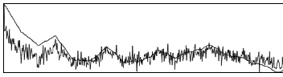

今回は距離測定のために精密なパルス時刻検出が必要なためピークを尖らせることができるMFの派生であるPOFを使った
$$
\begin{align}
\mathrm{POF}[x_a, x_b]
&= \mathcal{F}^{-1}\left[\frac{\mathcal{F}\left[x_a(t)\right]^*}{|\mathcal{F}\left[x_a(t)\right]|}\mathcal{F}\left[x_b(t)\right]\right] \\
&= \mathcal{F}^{-1}\left[\frac{X_a^*(\omega)}{|X_a(\omega)|}X_b(\omega)\right]
\end{align}
$$

#### 信号同定とマルチパスフェージング
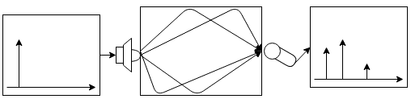
* 反射・回折によりピークが複数現れる、互いに弱め合うなどの現象
* 回折して届いた第一波よりも
  壁に反射して届いた第二波の方が信号強度が高いなどの問題

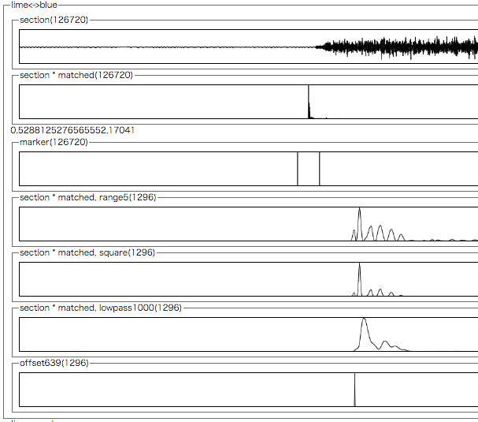
* 閾値処理、ピークの前で偏差値80のものを第一波に
* 包絡線を得るため、二乗し、LPFにかけた

---

### 多元接続とアレイ制御システム

#### いつどの端末がパルスを出すのか

#### 前回の手法

##### TDMA+トークンリング+Chord
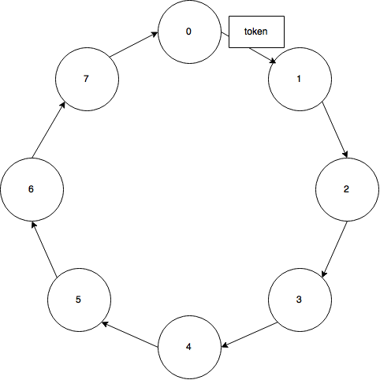

##### TDMA+トークンリング+Chord
* TDMAの時間の分散排他制御にリングネットワークを使用
* リングネットワークの構築にはChordを使用
* WebRTC P2Pで(TDMA進行)サーバいらず(P2Pシグナリングサーバは必要)
* 各端末で並列計算

###### 前回までのしくみ Time Division Multiple Access
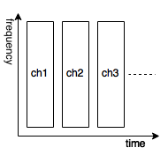
- パルス圧縮は周波数領域を専有する
- バースト信号で時間を分割
- TDMAを用いれば各デバイスに目一杯帯域を割り振れる

###### 前回までのしくみ 分散排他
- 時間を分割とは、つまり時間の排他制御
  - 排他制御といえばトークンリング

###### 前回までのしくみ Chord DHT

- Join と Stabilizeという２つのアルゴリズムでP2Pリングネットワークを構築
- トークンリングのトークンをバースト信号として利用

##### 前回までのしくみ

* 3端末でぐるぐると処理を回す

##### 前回の問題点
* P2P接続のためのWebRTCがHTTPSでしか使えなくなった
  * HTTPSサーバを立てるコストが高いので実験環境つくれない
* FFTの計算が重くてNexus7(2013)がフリーズ

#### 今回の手法

##### TDMA+進行サーバ+計算サーバ
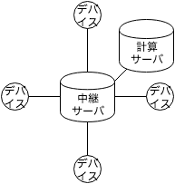
* P2PをやめてTDMA進行サーバと計算サーバを導入
* WebSocketによるスター型ネットワーク
* 計算サーバの負担が大きいが動かないよりマシ

##### 仮想音源の移動のためのUI
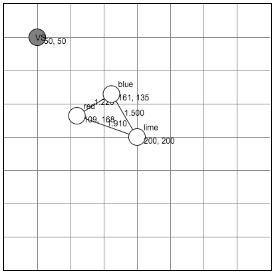
* 計算サーバから制御
* VSをドラッグすることで動的に仮想音源の位置を変えられる
* 仮想音源を鳴らしながら移動できる

---

## 実験と考察

### …はないのでデモ

---

## 今後の展開

### 既知の問題

* TDMAのみではN回の排他的パルス送信が必要
  * TDMA+CDMA化で効率化
    * Nexus7ではBPSKしたGold符号を分離できず

* 閾値処理の信号同定がマルチパスに弱い
  * RAKE化
    * 通常のRAKEではSN比向上しても信号時刻を特定できない
      * 独自の信号同定手法を検討

* Nexus7が録音中に頻繁にバッファを取りこぼす
  * 実験に別の機種を検討

* 端末間での音圧校正
  * 以前のは3端末用なのでDBAP法に使える多端末用の音圧校正手法が必要

---

## おわり
