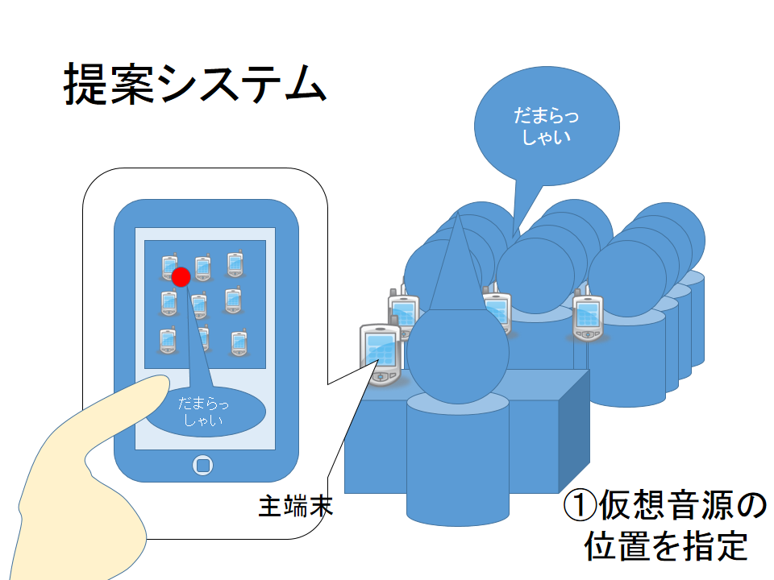
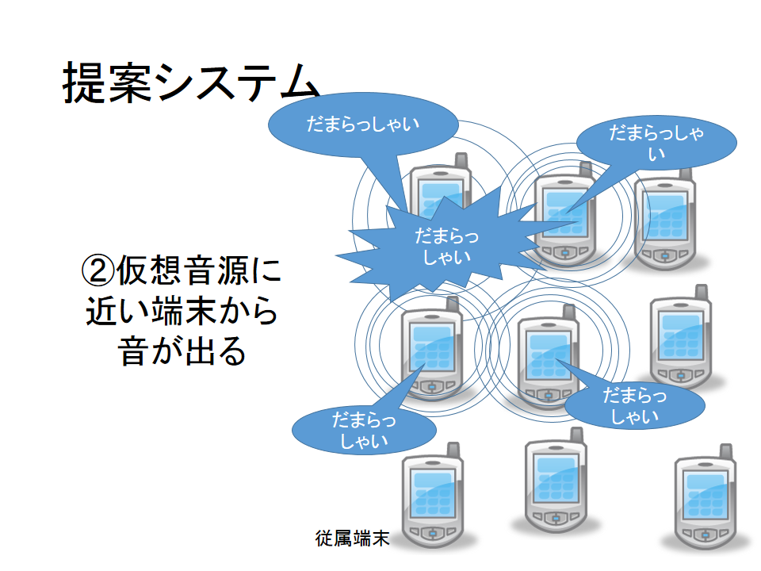
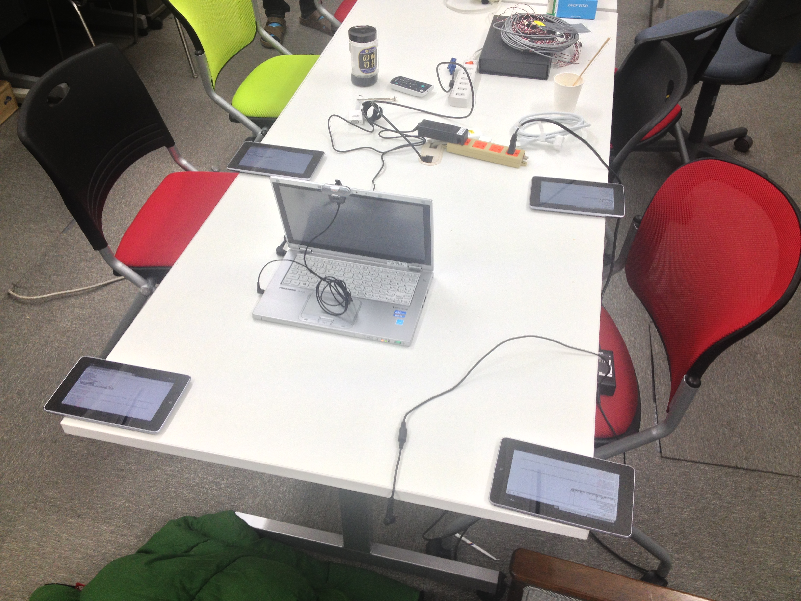
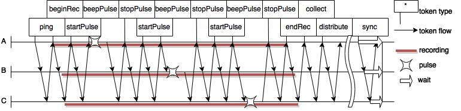

# 複数の携帯端末による教室空間の空間音響環境構築手法の検討

---

## 概説

- 個人が所有するスマートデバイスを用いて
- 空間音響を構築し相互の位置に応じた
- 音による情報提供を行うシステムを開発

### 想定

- 教室にいるたくさんの人々のスマートデバイス
- スピーカを同期的に制御
- 特定の位置に仮想音源を配置
- 音による注視効果狙う
- 例：教室空間で屁の音が聞こえた時

### 

### 

### 研究背景

- 生活空間へのスマートデバイスの普及
- 複数端末を利用したシステム構築の試み
- 例： Wireless Acoustic Sensor Networks
  - BeepBeep: A High Accuracy Acoustic Ranging System using COTS Mobile Devices[Chunyi Peng]

身近なスマートデバイスを用いて色々できる時代になった

### そこで

- スマートデバイスのマイクロホンとスピーカを利用
- 音声信号で相対位置を把握
- スピーカアレイを構築

**音像定位**しよう

---

## 先行研究

- 身近にあるスマートデバイスを用いて
- 位置に基づく情報提示という観点で

#### 音の発信を利用したキャリブレーションに基づく
#### アドホックマイクロホンアレイによる音源定位
##### [柴田一暁]

- **複数スマートデバイスのマイクロホン**で取得した多チャネル信号を処理
- 音源定位,音源強調,音源分離などを行う

スマートデバイスでアレイを構成する点においては似ているが、
こちらはスピーカアレイを構築する点で異なる

#### 位置情報を利用した携帯端末への音声情報配信
##### [河越嵩介]

- 位置情報に基いてスマートフォンから**音声情報案内**
- 例：観光地で次に行く場所を案内
- GPSで位置、イヤホンで音声案内

個人に向けての注意喚起であり集団における注意喚起ではない

#### 空間把握性に注目した
#### 音響案内システムの開発に関する研究
##### [梅津 直貴]

- 音声ARに立体音響効果を付加
- 例：美術館で頭が向いている方向の**音声案内**が大きく聞こえる
- カクテルパーティー効果を期待

デバイスを用いた高臨場感音像定位という点では似てるが、
個人向けのデバイスで集団における注意喚起ではない

### 先行研究の欠点
- 複数端末を用いてマイクロホンアレイを構築は存在するが、複数端末を用いて**スピーカアレイを構築は未研究**
- スマートデバイスを用いた情報提供システムとしてみると、**個人向け**の研究が
多い
- **「複数のスマートデバイスを用いて複数の人間に働きかける」は未開拓分野**

今後さらに生活空間にスマートデバイスが普及するためこの研究は**重要**

---

### 音圧校正

#### 音声伝達のプロセスをモデル化

$$
x[ij] = m[j] d[ij] v[i]
$$

- $m[i]$ は受信側のスピーカボリューム係数、
- $v[j]$ は送信側のマイクボリューム係数、
- $d[ij]$ は相対距離に基づく減衰係数
- $x[ij]$ は端末jが受信した端末iの信号
- スピーカボリュームを操作することで $v[i]$ を均一化

#### 音圧レベルを均一化
- 3端末の場合、
- $v[1]$ を1とすると、
  - $v[2]$ は$v[1]\frac{x[23]d[13]}{x[13]d[23]}$ 倍
  - $v[3]$ は$v[1]\frac{x[32]d[12]}{x[12]d[32]}$ 倍
- にすればよい

---

## システム構成

### システム使用のイメージ

#### 3ノードの場合の同期測距の時系列ダイヤグラム

---

### 距離計測実験

#### 端末Aの時分割された観測波形

#### 端末Aの各区間の相関検出結果

---

### 実験予定
- 同期できているか
  - 同期後の端末の出力の位相差をオシロスコープで計測

---

## 今後の展開

* システムにGUIつける
* 音像定位の実験

---

## おわり

---
